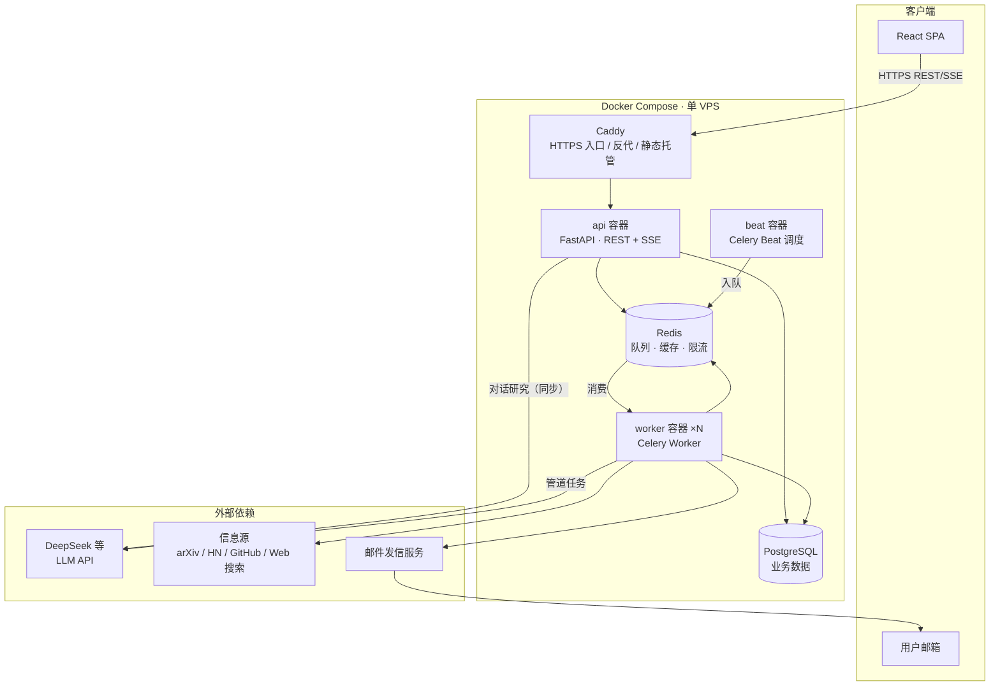
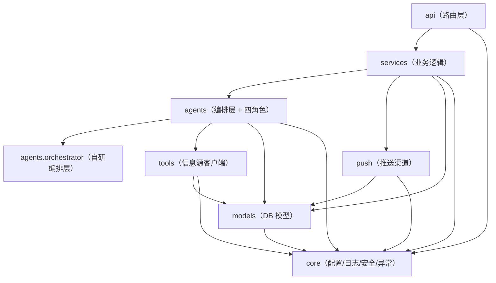

# TradeWinds 架构与项目结构

| | |
|---|---|
| 版本 | v0.1 |
| 日期 | 2026-09-06 |
| 状态 | 评审中 |
| 关联文档 | [设计文档](design.md) · [扩展计划](scaling-plan.md) · [实施计划](plans/) |

> 设计文档约定"做什么、为什么"；本文约定"代码怎么组织"——运行时架构、包结构、命名与依赖规则。实现计划据此拆解任务。结构可随实现演进，但**依赖规则与命名规范不因图省事而破坏**。

## 1. 运行时架构



要点：

- **api 与 worker 职责分离**：同步请求（REST/SSE）在 api；一切可能耗时的处理（检索管道、邮件）走 Celery 任务在 worker 执行。对话研究是唯一在 api 进程内同步调用 LLM 的场景（用户正等待流式响应）
- **beat 是全局唯一调度者**：只负责"到点入队"，不执行任何业务逻辑
- 所有容器同镜像不同启动命令，CI 只构建一次

## 2. 模块依赖规则



硬性规则（review 时逐条检查）：

1. 依赖方向只能自上而下，**禁止反向 import**（如 models 不得 import services）
2. `core` 不依赖任何业务模块
3. 路由层（api）不含业务逻辑：只做校验、调用 services、组装响应
4. `agents` 不直接 import `api` 的任何内容；`tools` 不 import `agents`（工具被编排层调用，反向依赖即错）
5. 跨层传递的数据一律为 Pydantic 模型，禁止裸 dict 在模块边界流动

## 3. 项目结构

```
TradeWinds/
├── AGENTS.md                       # AI/协作者开发准则
├── README.md                       # 项目门面
├── Makefile                        # make lint / test / migrate / run 等统一入口
├── pyproject.toml                  # 依赖 + ruff/mypy/pytest/coverage 配置唯一来源
├── .env.example                    # 环境变量样例（全部变量含注释），.env 不入库
├── docker-compose.yml              # 本地开发与生产共用的编排
├── deploy/
│   ├── Caddyfile                   # HTTPS 入口配置
│   └── prod.compose.yml            # 生产覆写（镜像 tag、副本数、资源限制）
├── .github/workflows/
│   ├── ci.yml                      # lint + type + test（PR 必过）
│   └── deploy.yml                  # main 分支构建镜像 → SSH 部署
├── docs/
│   ├── design.md                   # 设计文档
│   ├── architecture.md             # 本文
│   ├── scaling-plan.md             # 扩展计划
│   ├── plans/                      # 实施计划书
│   └── study/                      # 学习文档（每个 Task 交付后产出）
├── src/tradewinds/
│   ├── __init__.py
│   ├── main.py                     # FastAPI 应用工厂 create_app()
│   ├── core/                       # 基础设施，无业务语义
│   │   ├── config.py               # Settings（pydantic-settings，前缀 TRADEWINDS_）
│   │   ├── logging.py              # structlog 配置
│   │   ├── security.py             # bcrypt 密码哈希、JWT 签发与校验
│   │   ├── exceptions.py           # 异常基类与全局错误码
│   │   └── db.py                   # async engine / session 工厂
│   ├── models/                     # SQLAlchemy 模型 + 枚举
│   │   ├── user.py
│   │   ├── topic.py
│   │   ├── item.py
│   │   ├── report.py
│   │   ├── conversation.py         # conversation + message
│   │   └── push_log.py
│   ├── api/
│   │   ├── deps.py                 # 依赖注入：当前用户、DB session、Redis
│   │   └── v1/
│   │       ├── auth.py             # /auth/*
│   │       ├── topics.py           # /topics/*
│   │       ├── items.py            # Feed 读取
│   │       ├── reports.py          # /reports/*
│   │       ├── conversations.py    # /conversations/*（含 SSE）
│   │       └── health.py           # /healthz /readyz
│   ├── services/                   # 业务逻辑，一个领域一个文件
│   │   ├── auth_service.py
│   │   ├── topic_service.py        # 主题 CRUD、配额、计划预览
│   │   ├── item_service.py         # 条目查询、去重落库
│   │   ├── pipeline_service.py     # 订阅执行管道的编排入口
│   │   ├── chat_service.py         # 对话编排入口
│   │   └── quota_service.py        # 配额计算与扣减
│   ├── agents/
│   │   ├── orchestrator/           # 自研编排层（不含业务）
│   │   │   ├── llm.py              # LLMProvider 协议 + OpenAI-compatible 实现
│   │   │   ├── loop.py             # 工具循环执行器
│   │   │   ├── structured.py       # 结构化输出执行器（校验失败重试）
│   │   │   ├── streaming.py        # SSE 事件流封装
│   │   │   └── metering.py         # token/成本计量上报
│   │   ├── prompts/                # prompt 全部独立文件（.md/.txt），代码不内嵌
│   │   │   ├── planner.md
│   │   │   ├── analyst.md
│   │   │   └── editor.md
│   │   ├── schemas/                # 角色间传递的 Pydantic 模型（检索计划、评分、摘要）
│   │   ├── planner.py              # 各角色 = prompt + schema + 编排层调用的薄封装
│   │   ├── retriever.py
│   │   ├── analyst.py
│   │   └── editor.py
│   ├── tools/                      # 信息源客户端，一个源一个模块，同构接口
│   │   ├── base.py                 # SourceClient 协议 + 公共 httpx 工厂
│   │   ├── arxiv.py
│   │   ├── hackernews.py
│   │   ├── github.py
│   │   ├── websearch.py            # Tavily/Brave，可切换
│   │   └── fetcher.py              # 通用网页抓取 + 正文提取
│   ├── tasks/                      # Celery 层：任务定义、队列路由、beat 调度
│   │   ├── celery_app.py           # 应用工厂、队列/路由/重试策略
│   │   ├── pipeline_tasks.py       # 主题检索管道任务
│   │   ├── push_tasks.py           # 邮件推送任务
│   │   └── schedules.py            # beat 配置
│   └── push/
│       ├── base.py                 # PushChannel 协议
│       ├── email.py                # 邮件渠道（模板渲染 + 发送 + 重试）
│       └── templates/              # Jinja2 邮件模板
├── frontend/
│   └── src/
│       ├── features/               # 按业务特性组织，跨特性不互相 import
│       │   ├── auth/  topics/  feed/  chat/
│       └── shared/                 # api client、通用组件、类型
└── tests/
    ├── unit/                       # 纯逻辑（镜像 src 结构）
    ├── contract/                   # 信息源解析（录制响应固件 fixtures/）
    ├── agents/                     # 编排层与角色（LLM 全 mock + 金标集）
    └── integration/                # 真实 PG/Redis 容器，全链路
```

## 4. 命名规范

| 对象 | 规范 | 示例 |
|---|---|---|
| 包/模块 | 小写下划线，单数名词，名即职责 | `item_service.py`，禁止 `utils.py`、`common.py` |
| 类 | 大驼峰 | `TopicService`、`ArxivClient` |
| 函数/变量 | 小写下划线，动词开头（函数） | `create_topic`、`fetch_since` |
| Pydantic 模型 | 后缀表用途：请求/响应/Agent 产物 | `TopicCreate`、`ItemRead`、`RetrievalPlan` |
| SQLAlchemy 模型 | 单数类名，**复数表名** | 类 `User` → 表 `users` |
| Celery 任务 | `tradewinds.tasks.<模块>.<动作>` 全限定名 | `tradewinds.tasks.pipeline_tasks.run_topic` |
| 队列 | 短小写，按重量命名 | `default`、`pipeline`、`push` |
| 环境变量 | `TRADEWINDS_` 前缀大写 | `TRADEWINDS_DATABASE_URL` |
| 数据库迁移 | 自动生成 + 语义化 message | `add topics table` |
| 分支 | `feat/`、`fix/`、`docs/` 前缀 | `feat/orchestrator-loop` |
| API 路径 | 复数资源、kebab 无、版本前缀 | `/api/v1/conversations/{id}/messages` |
| 测试文件 | `test_<被测模块名>.py`，镜像 src 路径 | `tests/unit/services/test_topic_service.py` |

## 5. 关键抽象（接口契约）

实现计划与编码以这些协议为锚点，签名变更须同步本文件：

```python
# agents/orchestrator/llm.py —— 模型供应商抽象，DeepSeek/GLM 可切换
class LLMProvider(Protocol):
    async def complete(self, messages: list[Message], *, model: ModelTier,
                       response_model: type[T] | None = None) -> LLMResult[T]: ...
    def stream(self, messages: list[Message], *, model: ModelTier) -> AsyncIterator[str]: ...

# agents/orchestrator/loop.py —— 工具循环（Retriever 对话模式的核心）
class ToolLoop:
    def __init__(self, provider: LLMProvider, tools: ToolRegistry, *,
                 max_iterations: int = 10, total_timeout: float = 120.0): ...
    async def run(self, messages: list[Message]) -> LoopResult: ...

# tools/base.py —— 所有信息源客户端同构，新增源=新增一个实现
class SourceClient(Protocol):
    name: str
    async def search(self, plan: RetrievalPlan, *,
                     seen_hashes: set[str]) -> list[CandidateItem]: ...

# push/base.py —— 推送渠道抽象（邮件先实现，站内通知后接）
class PushChannel(Protocol):
    async def send(self, payload: PushPayload) -> PushReceipt: ...
```

约定：`ModelTier`（low/mid）映射到具体供应商型号的配置在 `core/config.py`，代码中不出现型号字符串。

## 6. 工程配套（大项目必备清单）

| 项 | 落点 | 要求 |
|---|---|---|
| 代码风格 | ruff（format + lint），配置在 pyproject.toml | CI 强制 |
| 类型检查 | mypy strict（src 范围） | CI 强制 |
| 测试 | pytest + pytest-asyncio + coverage（目标：核心逻辑行覆盖 ≥ 85%） | CI 强制 |
| 提交钩子 | pre-commit（ruff、mypy 快速档） | 本地强制 |
| 统一入口 | Makefile：`lint` / `type` / `test` / `migrate` / `dev` / `up` / `down` | 禁止凭记忆敲长命令 |
| 环境变量 | `.env.example` 全量样例带注释；Settings 启动即校验，缺配 fail-fast | — |
| 数据库迁移 | Alembic，只进不退（回滚用新迁移），CI 起真库跑迁移 | — |
| 密钥管理 | 全部走环境变量；仓库内无任何真实密钥；Sentry/DSN 等同密钥管理 | — |
| 错误码 | `core/exceptions.py` 集中定义业务异常 → 统一错误响应体 `{code, message}` | — |
| 文档纪律 | 见 AGENTS.md 第 0/9/10 节（阅读地图、文档同步、study 学习文档） | 每个 Task 后写 study |
